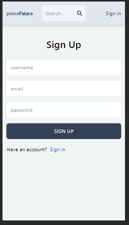
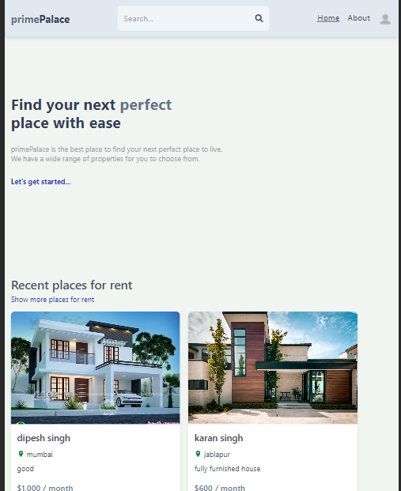
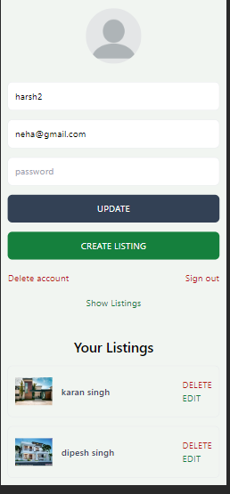
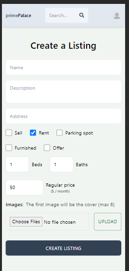

# free4talk - Chat Application 



Home_page



About_page


Property Listed by you for sell or rent



add new property for rent or for sell




## Installation Guide

### Requirements
- [Nodejs](https://nodejs.org/en/download)
- [Mongodb](https://www.mongodb.com/docs/manual/administration/install-community/)

Both should be installed and make sure mongodb is running.


Now install the dependencies
```shell
npm i 
cd client
npm i
We are almost done, Now just start the development server.

For Frontend.
```shell
cd client
npm run dev
```
For Backend.

Open another terminal in folder, Also make sure mongodb is running in background.
```shell
cd api
nodemon index.js
```

Done! Now open localhost:5173 in your browser.
